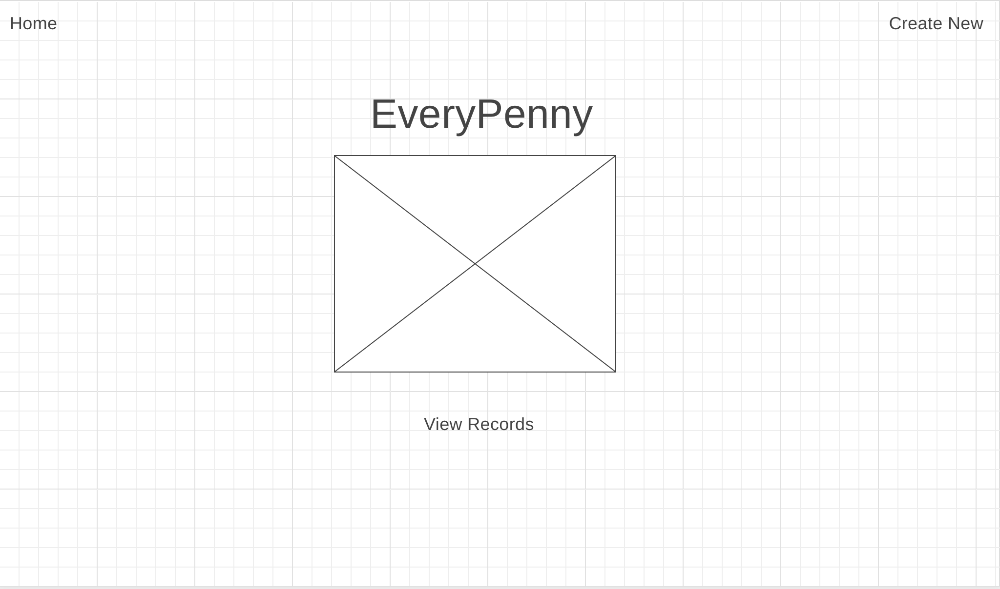
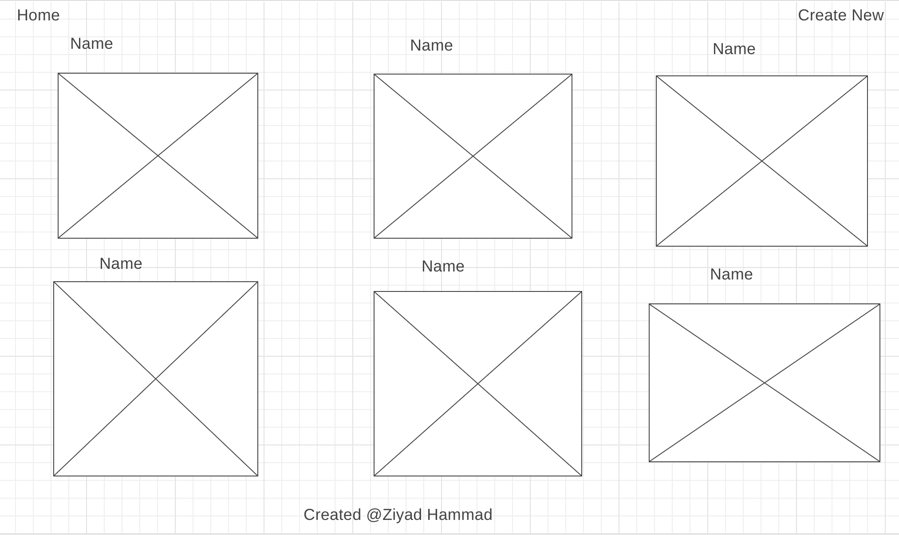
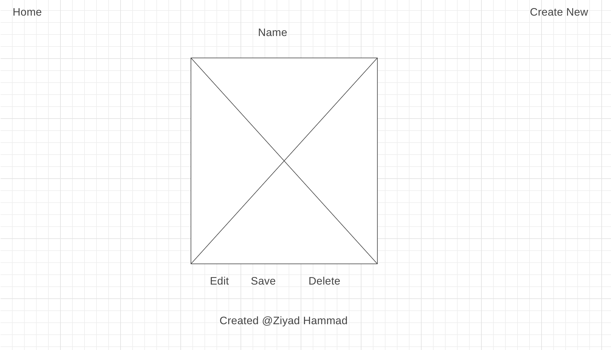
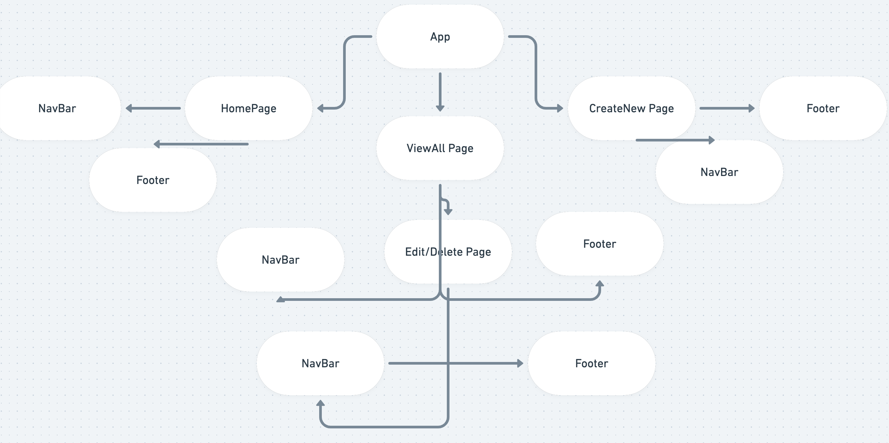

# EveryPenny
https://distracted-dijkstra-a1d71b.netlify.app


## Project Description

EveryPenny is a user friendly financial tracking app that allows users to create a list of their monthly income and expenses. They can then store and save their monthly financials for later reference.

## Wireframes

The wireframes below reveals how the website will be formatted. Below you will see the home page, create new financial list page, view all list page, and a edit and delete page.






## Component Hierarchy



## API and Data Sample

https://airtable.com/tblV42zNZDoD9Xhgu/viwjCArNNc3Ilm7Jj?blocks=hide

Airtable is returning the data for this base as follows:

```
{
    "records": [
        {
            "id": "recqnGLMgD87R9sOW",
            "fields": {
                "name": "Ziyad Hammad",
                "date": "July 13, 2021",
                "income": "3,000",
                "rent": "1,400",
                "auto": "170",
                "food": "400",
                "misc": "400",
                "utilities": "300",
                "entertainment": "100",
                "healthandwellness": "150"
            },
            "createdTime": "2021-07-13T15:30:42.000Z"
        }
    ],
    "offset": "recqnGLMgD87R9sOW"
}

```

### MVP/PostMVP

#### MVP

- Home page with clickable buttons that route to each respective feed.
- Fulfill a axios get request to append data to the UI.
- Fulfill a post request to allow users to create a monthly finance sheet.
- Style website to be responsive.
#### PostMVP

- Look for some animation libraries to make the UI more attractive/user-friendly.
- Add a section where the user can edit and delete previously stored finance sheet
- Add some visuals to show percentages spent from monthly income.

## Project Schedule

| Day      | Deliverable                                | Status   |
| -------- | ------------------------------------------ | -------- |
| Oct 9-11 | Proposal Approval / Airtable Setup        |Complete |
| Oct 12   | Component Creation / Get, Set, Delete Data |Complete |
| Oct 13   | Oct. 12 cont'd / CSS Components            |Complete |
| Oct 14   | CSS Components cont'd / MVP                |Complete |
| Oct 15   | Advanced CSS                               |Complete |
| Oct 16   | Presentations                              |Complete |

## Timeframes

| Component                 | Priority | Estimated Time | Time Invested | Actual Time |
| ------------------------- | :------: | :------------: | :-----------: | :---------: |
| Proposal                  |    H     |      2hrs      |     2hrs      |    3hrs     |
| Airtable setup            |    H     |     .5hrs      |      1hr      |     .5hr     |
| NavBar          |    H     |      2hrs      |      1hr      |     3hr     |
| Footer     |    H     |      3hrs      |     3hrs      |    3     |
| HomePage     |    H     |      3hrs      |     2hrs      |    3hr     |
| Styling for HomePage/Footer/NavBar     |    H     |      3hrs      |     2hrs      |    3hr    |
| ViewAll Page       |    H     |      3hrs      |     2hrs      |    2hrs     |
|       Styling for ViewAllPage |    H     |      3hrs      |     1 hr      |    3hr    |
| CreateNew Page      |    H     |      3hrs      |     1 hr      |     3hr    |
| CreateNew Page Styling|    H     |      3hrs      |     3hrs      |    3hrs     |
| Edit/Delete Page|    H     |      3hrs      |      1hr      |     3hr    |
| Styling for Edit Page|    H     |      3hrs      |      1hr      |     3hr     |
| Additional Styling(advanced)       |    H     |      3hrs      |      1hr      |     3hr    |


## SWOT Analysis

### Strengths:

I have a good understanding of what i want my application to look like and what exactly I want it to do. That being said I can better plan out how I'm going to use my time and execute my project in a timely matter. 

### Weaknesses:

I am still not terribly clear on CRUD and how I can get really creative with it. I do have some resources I can look back on if I do need help.

### Opportunities:

This project will allow me to practice what I've learned the past two weeks in unit 2. This should help me solidify my knowledge on react and what I can improve on.

### Threats:

Whenever my code doesnt work or I recieve an error I'll get stuck on the issue for a long time trying to debug and what not. I also tend to take a lot of time on css side of things. I'm not that strong as of right now with the styling aspect however I plan on expanding my css skills by trying new ways of styling that I'm used to for this project.